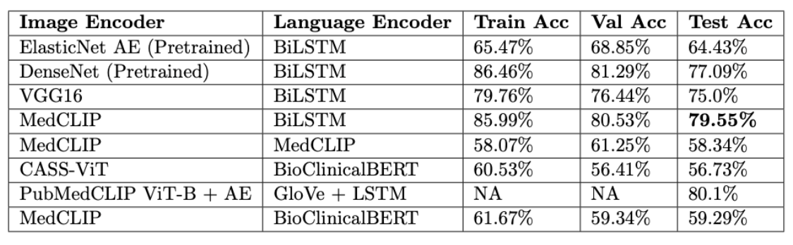
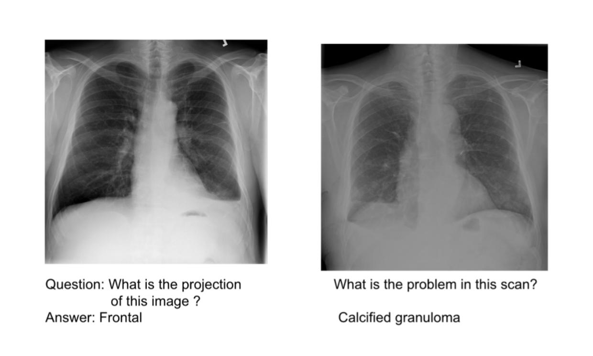

# MedVQA
## Visual Question Answering for Radiology Images

## Project Description

VQA is a multi-disciplinary problem involving various domains such as Computer Vision, Natural Language Processing, Knowledge Representation and Reasoning, etc., The input consists of an image and a free form or open ended natural language question, the task is to provide an accurate natural language answer. Since the question may selectively target any minute details in the complex scene portrayed by the input image, there is a need for a neural architecture that can effectively learn a joint embedding representation in the multi-modal space combining the text and image representations using some form of attention.

Inspired by the extensive research conducted on generic, free form and open-ended Visual Question Answering (VQA), medical VQA has recently garnered attention and researchers have recently started exploring the scope of VQA in the medical and healthcare domain. We experiment with several deep learning models for effective image and text representation learning and demonstrate the effectiveness of intra-domain transfer learning over inter-domain transfer learning in the task of medical VQA. The proposed approach achieves accuracies comparable to the benchmark while being simpler in architecture.

In our experiments, we model our approach inspired by [1, 3, 4] as shown below, but our motive is to strike the right tradeoff between model complexity / performance and accuracy. Our aim is to show that even a simpler architecture with the right design choices can help achieve accuracies reasonably close to the state-of-the-art, while being computationally efficient.


We work with the VQA baseline model[1] that uses a VGGNet to encode images and a two layer LSTM to encode questions, and transforming them to a common space via an element-wise multiplication, which is then through a fully connected layer followed by a softmax layer to obtain a distribution over answers. We explore various settings on this simple architecture and work on improving the VQA accuracy.


## Repo Structure
    .
    ├── dataset.py            # dataset for the preprocessed data
    ├── download_datasets.sh  # script to download VQA2.0 data and extract them
    ├── images                # iamge files used in readme
    ├── main.py               # entry point for training, takes various arguments
    ├── models
    │	 └── baseline.py      # baseline model from VQA paper
    ├── preprocess.py         # preprocess the VQA2.0 data and save vocabulary files
    ├── README.md             # readme file
    ├── train.py              # functions to train the model
    ├── utils.py              # utility functions
    └── vectorize_images.py   # save image embeddings to pickle file
    └──generate_glove_embeddings.py   # save word embeddings to pickle file
    └──grid_search.py   # perform a grid search for hyper-parameter tuning to optimize the given set of params

## Usage

#### 0. Install Dependencies
We recommend to use conda environment to install the pre-requisites to run the code in this repo. We can install the packages required from `requirements.txt` file using the command
```bash
conda create --name myenv --file requirements.txt
```

Following are the important packages requried

- matplotlib==3.7.1
- numpy==1.24.3
- opencv_python==4.7.0.72
- pandas==1.5.3
- Pillow==9.4.0
- Pillow==9.5.0
- pydicom==2.3.1
- pytorch_lightning==2.0.2
- skimage==0.0
- tensorboard==2.12.3
- tensorboardX==2.2
- tensorboardX==2.6
- timm==0.6.13
- torch==2.0.0
- torchcontrib==0.0.2
- torchmetrics==0.11.4
- torchvision==0.15.0
- torchxrayvision==1.1.0
- tqdm==4.65.0
- transformers==4.24.0

#### 1. Preprocess Data
We first preprocess the data we have into a simple format to train the model easily. Run the following command by passing the `data_dir` argument with the directory where we downloaded the dataset to.
```
python preprocess.py --data_dir ../Dataset
```
This script processes all the questions, annotations and saves each question example as a row in `image_id`\t`question`\t`answer`\t`answers` format in the processed `train_data.txt` and `val_data.txt` files. `image_id` is the unique id for each image in the respective train and val sets. The question and answer are space separated, answers is ^ separated for convenience. The answers are the 10 possible answers, and answer is the most frequent among them. This also saves the vocabulary of words in training questions mapping word to index and also index to the word in `questions_vocab.pkl` file, and also the frequencies of answers (that will be used later to construct the vocabulary for answers) in `answers_freq.pkl` file.

#### 2. Dataset
We use the SLAKE dataset[5] in our experiments to finetune pretrained visual and text encoders and for evaluation. SLAKE can be downloaded [here](https://www.med-vqa.com/slake/).

Run preprocess.py on Slake1.0 using the following command:
```
python3 preprocess.py --data_dir Slake1.0
```

The data directory structure after running the above command should look like this:
    
    ├── imgs                                                # 642 images
    │    └── xmlab0                                         
    │        └── source.jpg                                 # Actual images
    │        └── mask.png
    │        └── detection.json
    │        └── question.json
    │    └── xmlab1
    │    ......
    │    └── xmlab641
    ├── test_data.txt                                       # imgId,question,answer       
    ├── train_data.txt                                      # imgId,question,answer
    ├── val_data.txt                                        # imgId,question,answer

#### 3. Pre Compute Word Embeddings (if using GloVe, else optional)
```
python generate_word_embeddings.py --data_dir ../Dataset 
```

#### 4. Train a model
We can run a training experiment using `main.py` script, which has various arguments required by the code. For information about each flag and its usage, we can run `python main.py -h`, which gives the following description:
```
usage: main.py [-h] [--data_dir DATA_DIR] [--model_dir MODEL_DIR] [--log_dir LOG_DIR] --run_name RUN_NAME --model {baseline} [--image_model_type {vgg16,resnet152}] [--use_image_embedding USE_IMAGE_EMBEDDING] [--top_k_answers TOP_K_ANSWERS] [--max_length MAX_LENGTH] [--word_embedding_size WORD_EMBEDDING_SIZE] [--lstm_state_size LSTM_STATE_SIZE] [--batch_size BATCH_SIZE] [--epochs EPOCHS]
               [--learning_rate LEARNING_RATE] [--optimizer {adam,adadelta}] [--use_dropout USE_DROPOUT] [--use_sigmoid USE_SIGMOID] [--use_sftmx_multiple_ans USE_SFTMX_MULTIPLE_ANS] [--ignore_unknowns IGNORE_UNKNOWNS] [--use_softscore USE_SOFTSCORE] [--print_stats PRINT_STATS] [--print_epoch_freq PRINT_EPOCH_FREQ] [--print_step_freq PRINT_STEP_FREQ] [--save_best_state SAVE_BEST_STATE]
               [--attention_mechanism {element_wise_product,sum,concat}] [--random_seed RANDOM_SEED] [--bi_directional {True, False}] [--use_lstm {True, False}] [--use_glove {True, False}] [--embedding_file_name {PATH_TO_GLOVE_PKL_FILE}]

VQA

options:
  -h, --help            show this help message and exit
  --data_dir DATA_DIR   directory of the preprocesses data
  --model_dir MODEL_DIR
                        directory to store model checkpoints (saved as run_name.pth)
  --log_dir LOG_DIR     directory to store log files (used to generate run_name.csv files for training results)
  --run_name RUN_NAME   unique experiment name (used as prefix for all data saved on a run)
  --model {baseline}    VQA model choice
  --image_model_type {vgg16,resnet152}
                        Type of CNN for the Image Encoder
  --use_image_embedding USE_IMAGE_EMBEDDING
                        Use precomputed embeddings directly
  --top_k_answers TOP_K_ANSWERS
                        Top K answers used to train the model (output classifier size)
  --max_length MAX_LENGTH
                        max sequence length of questions
  --word_embedding_size WORD_EMBEDDING_SIZE
                        Word embedding size for the embedding layer
  --lstm_state_size LSTM_STATE_SIZE
                        LSTM hidden state size
  --batch_size BATCH_SIZE
                        batch size
  --epochs EPOCHS       number of epochs i.e., final epoch number
  --learning_rate LEARNING_RATE
                        initial learning rate
  --optimizer {adam,adadelta}
                        choice of optimizer
  --use_dropout USE_DROPOUT
                        use dropout
  --use_sigmoid USE_SIGMOID
                        use sigmoid activation to compute binary cross entropy loss
  --use_sftmx_multiple_ans USE_SFTMX_MULTIPLE_ANS
                        use softmax activation with multiple possible answers to compute the loss
  --ignore_unknowns IGNORE_UNKNOWNS
                        Ignore unknowns from the true labels in case of use_sigmoid or use_sftmx_multiple_ans
  --use_softscore USE_SOFTSCORE
                        use soft score for the answers, only applicable for sigmoid or softmax with multiple answers case
  --print_stats PRINT_STATS
                        flag to print statistics i.e., the verbose flag
  --print_epoch_freq PRINT_EPOCH_FREQ
                        epoch frequency to print stats at
  --print_step_freq PRINT_STEP_FREQ
                        step frequency to print stats at
  --save_best_state SAVE_BEST_STATE
                        flag to save best model, used to resume training from the epoch of the best state
  --attention_mechanism {element_wise_product,sum,concat}
                        method of combining image and text embeddings
  --bi_directional {True,False}
                        True if lstm is to be bi-directional
  --use_lstm {True,False}
                        True if lstm is to be used
  --use_bert {True,False}
                        True if BioClinicalBERT is to be used for question encoding
  --use_glove {True,False}
                        True if glove embeddings are to be used
  --embedding_file_name EMBEDDING_FILE_NAME
                        glove embedding path file
  --random_seed RANDOM_SEED
                        random seed for the experiment

```
An example command to run the VQA baseline model - `python3 /home/apn7823/healthcare/MedVQA/main.py --run_name medvqa_32_100_bioclinicalbert_vgg16 --model baseline --use_bert True --data_dir /home/apn7823/datasets --model_dir /home/apn7823/healthcare/checkpoints --log_dir /home/apn7823/healthcare/logs --epochs 100 --top_k_answers 218 --batch_size 32 --use_dropout True --use_image_embedding False`

#### 5. Visualizing Training Results
Training statistics for an experiment are all saved using the run_name passed for it. Log files are save as tensorboard events in the log directory passed during training, and the parsed csv files of these logs are saved in the same directory. `utils.py` has multiple functions that can help visualize these csv files.

To view the VQA accuracies for multiple runs together we can use `python utils.py 'from utils import *; plot_vqa_accuracies(log_dir, ["run_13, run_23, run_43"])'` with the appropriate log directory.

#### 6. Predicting Answers
To predict answers for an image in the dataset, we can use the script `answer_questions.py` by passing the arguments that were used during training of that experiment. `python answer_questions.py --data_dir ../Dataset --model_dir ../checkpoints --run_name run_43 --top_k_answers 3000 --use_dropout True --image_loc val --image_id 264957`. In case of testing on a custom image and questions, we can use the function `answer_these_questions()` in `utils.py` that takes in the image path and a list of questions along with the other parameters that were used for the experiment during training.

#### Hyper-parameter tuning via grid-search with Optuna
To tune hyper-parameters of the model, we should first specify the parameters we wish to optimize and the list of choices for each param in the objective function in grid_search.py file. By default it will try to run trial runs with different combination of params, and prune the ones which are not learning well. The default objective is to find the trial which maximizes accuracy. However this can be changed to something like minimize training or val loss, etc as needed by tweaking the call to optuna.create_study(). The usage of this file is as follows :

` python grid_search.py --run_name testrun --model baseline --data_dir ../Dataset --model_dir ../checkpoints --log_dir ../logs --epochs 1 `

## Results

Given below are the VQA accuracy values we observed from various experiments through a combination of hyper parameters.


Here are some sample images and the top answers predicted using the best performing model -
<p align="center" float="left">
  
</p>

## References
1. [VQA: Visual Question Answering.](https://openaccess.thecvf.com/content_iccv_2015/papers/Antol_VQA_Visual_Question_ICCV_2015_paper.pdf)
2. [Making the V in VQA Matter: Elevating the Role of Image Understanding in Visual Question Answering.](https://openaccess.thecvf.com/content_cvpr_2017/papers/Goyal_Making_the_v_CVPR_2017_paper.pdf)
3. [Show, Ask, Attend, and Answer: A Strong Baseline For Visual Question Answering.](https://arxiv.org/pdf/1704.03162.pdf)
4. [Tips and Tricks for Visual Question Answering: Learnings from the 2017 Challenge.](https://openaccess.thecvf.com/content_cvpr_2018/papers/Teney_Tips_and_Tricks_CVPR_2018_paper.pdf)
5. [SLAKE: A Semantically-Labeled Knowledge-Enhanced Dataset for Medical Visual Question Answering](https://arxiv.org/abs/2102.09542)
